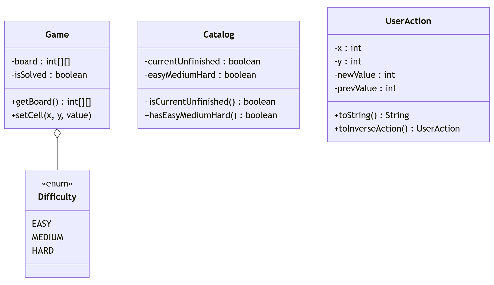
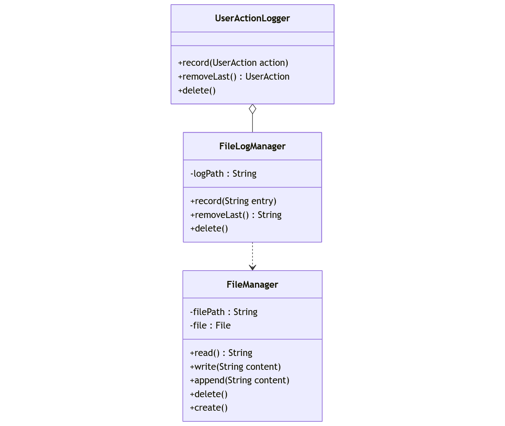
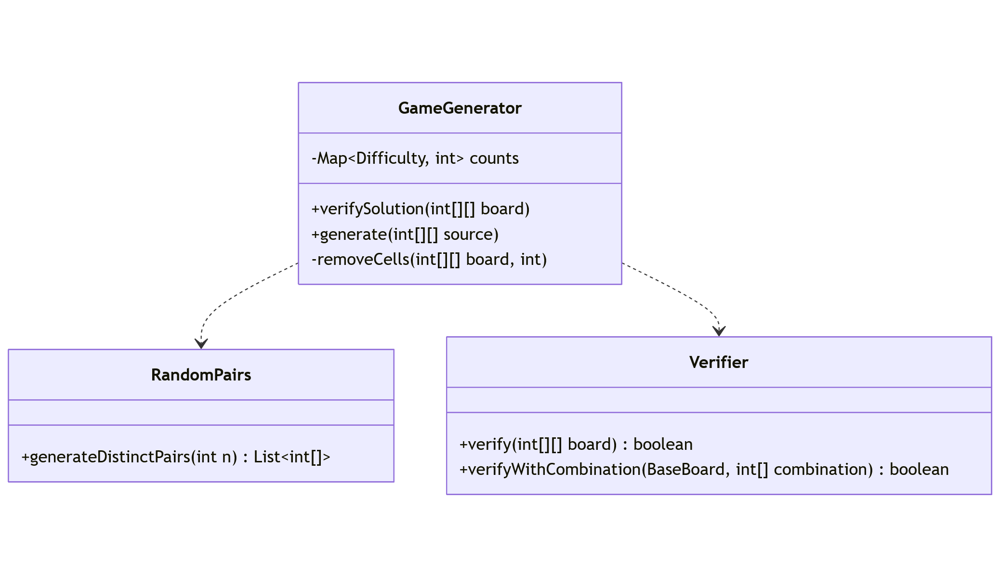
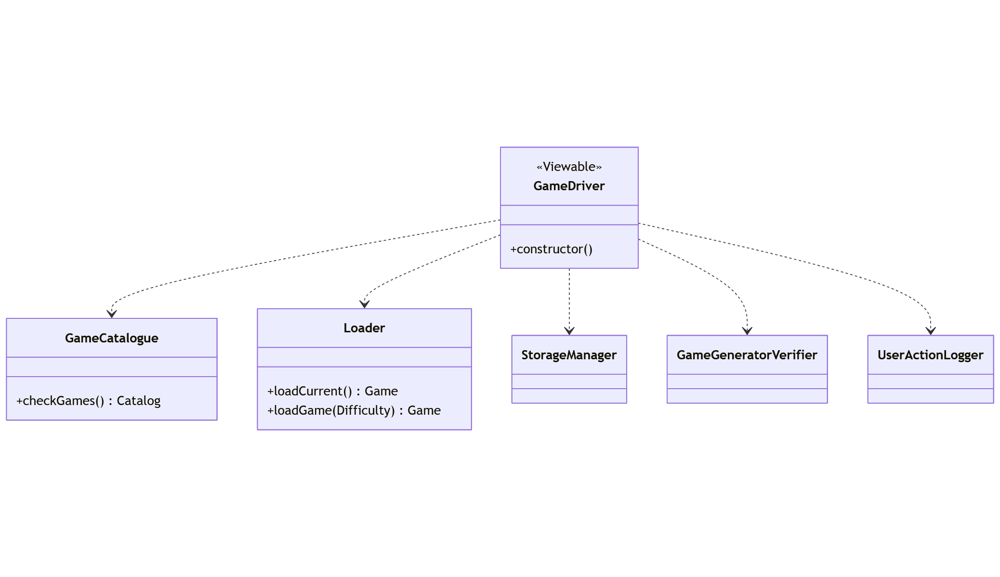
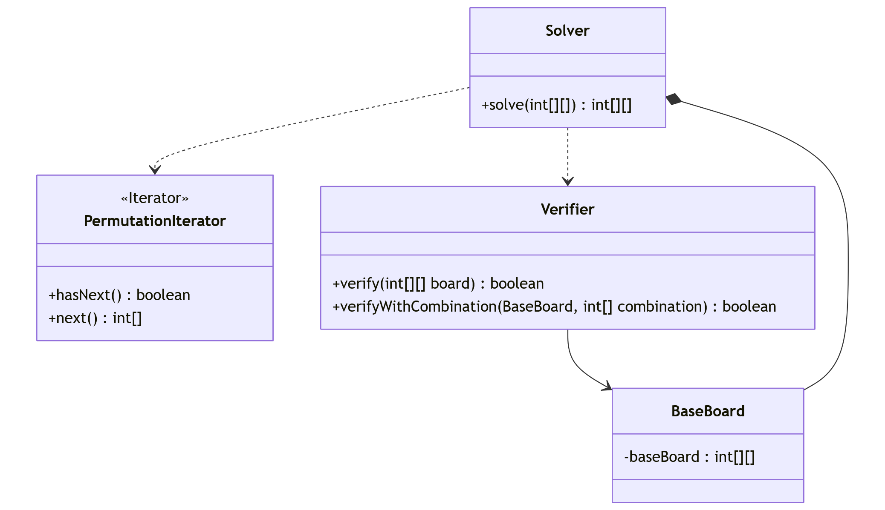

## Sudoku Game

### Table of Content

- [Diagrams](#diagrams)
- [Assignment](#assignment)
- [Team Members](#team)

### Assignment
The requirements requested by the TAs has be listed in this [pdf](https://drive.google.com/file/d/1A-o-iP1qx1kvj_UKhkltphIS6r9bCV5J/view?usp=drive_link).

Refer to it to check the completion of this project.

### Diagrams

### Team
- [Andrew Sameh Adel Mikhail](https://github.com/acskii) - ID **9489**

- [Abdoalrahman Khedr](https://github.com/Abdoalrahmankhedr) - ID **9624**

- [Hassan Mohsen](https://github.com/Hassanmo-20) - ID **9635**

- [Ahmed Sherif](https://github.com/ahmed-sherif-hassona) - ID **9631**
